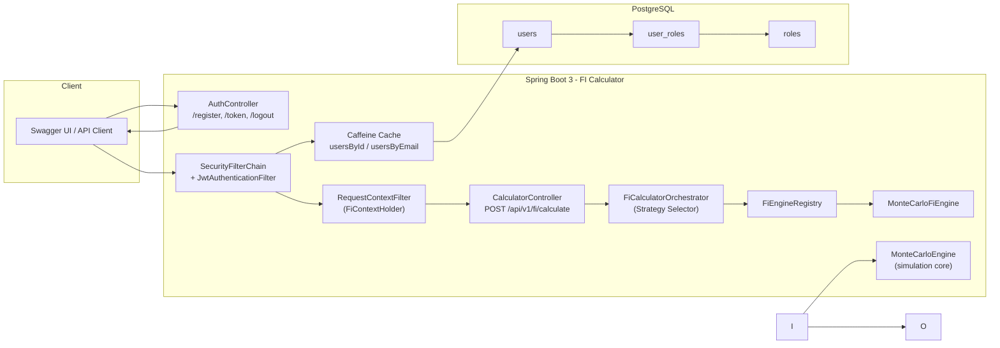
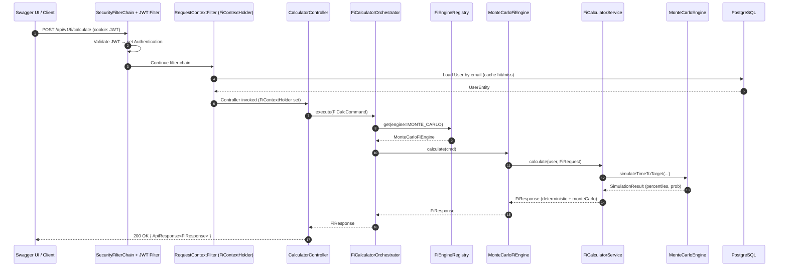
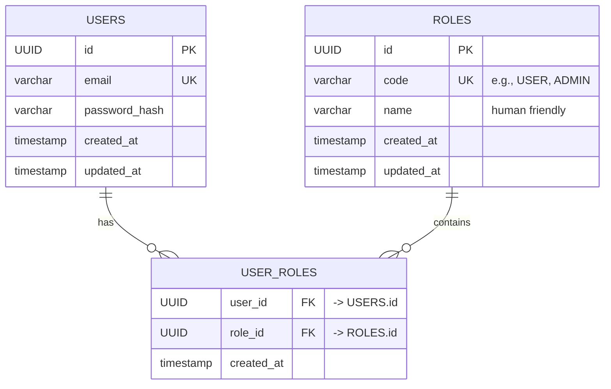

# FI Calculator

A Spring Boot 3 application for forecasting **Financial Independence (FI)** using deterministic and Monte Carlo simulations.  
Users can register, log in, and run FI projections with configurable assumptions.

---

## ✨ Features
- **User management**: Register & log in with secure JWT authentication (stored in `HttpOnly` cookies).
- **FI Calculator**: Deterministic projection plus optional Monte Carlo simulation.
- **Extensible engine design**: Easily plug in new calculation engines (Command + Strategy pattern).
- **API-first**: All APIs are fully documented with OpenAPI/Swagger.
- **Dockerized**: Easy startup with `docker compose`.

---

## ⚙️ Tech Stack
- **Java 21**, **Spring Boot 3.5**
- **Spring Security 6** (JWT + role-based auth)
- **Hibernate/JPA** with **PostgreSQL 16**
- **Swagger/OpenAPI 3** (via `springdoc-openapi`)
- **Docker Compose** (runs app + DB)
---


## 🚀 Getting Started

### 1. Clone the repo
```bash
git clone https://github.com/sepehrasadiyan/fi-calculator
cd fi-calculator
bash ./here.sh
```


## Step by Step


## Diagram of Process


## Database diagram



